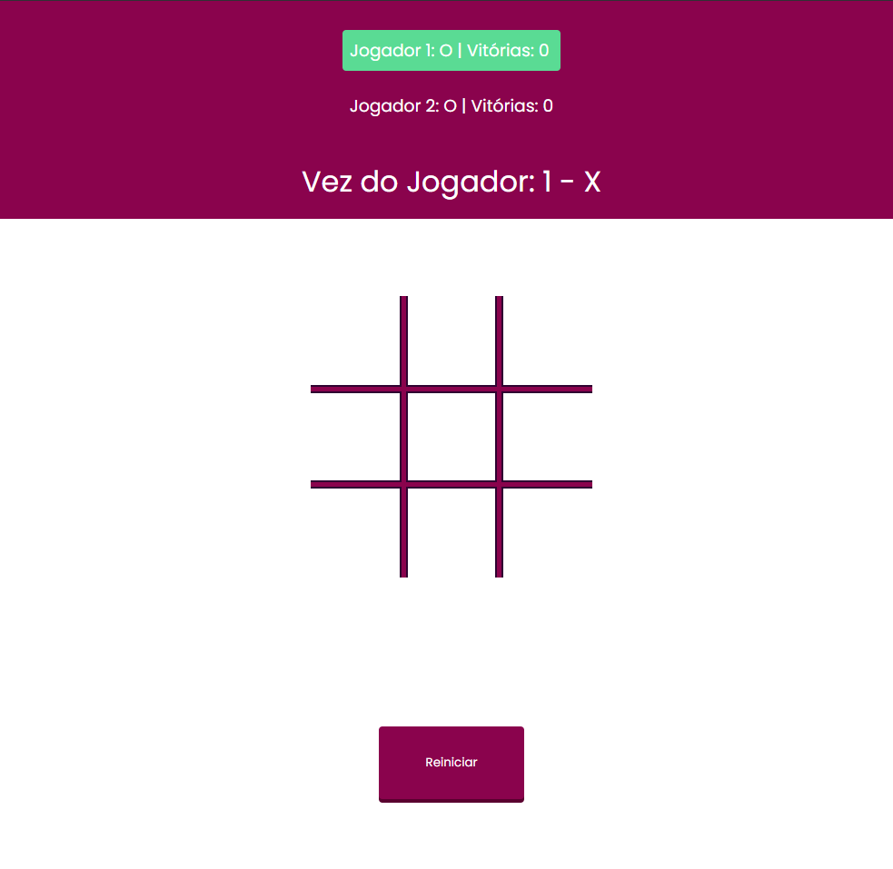

# 🎮 Jogo da Velha

Este é um simples jogo da velha desenvolvido com **HTML, CSS e JavaScript**.

## ✨ Funcionalidades

- 🔄 Dois jogadores alternam entre X e O
- 🏆 Verificação automática de vitória ou empate
- 📊 Placar acumulativo
- 🔁 Botão de reset para reiniciar o jogo

## 🕹️ Como Jogar

1. 📂 Abra o arquivo `index.html` no navegador.
2. ❌ O jogador **X** começa.
3. 🎯 Clique em um quadrado vazio para jogar.
4. ✅ O jogo detecta vitórias ou empates automaticamente.
5. 🔄 Clique em **"Reset"** para recomeçar.

## 🖼️ Preview

